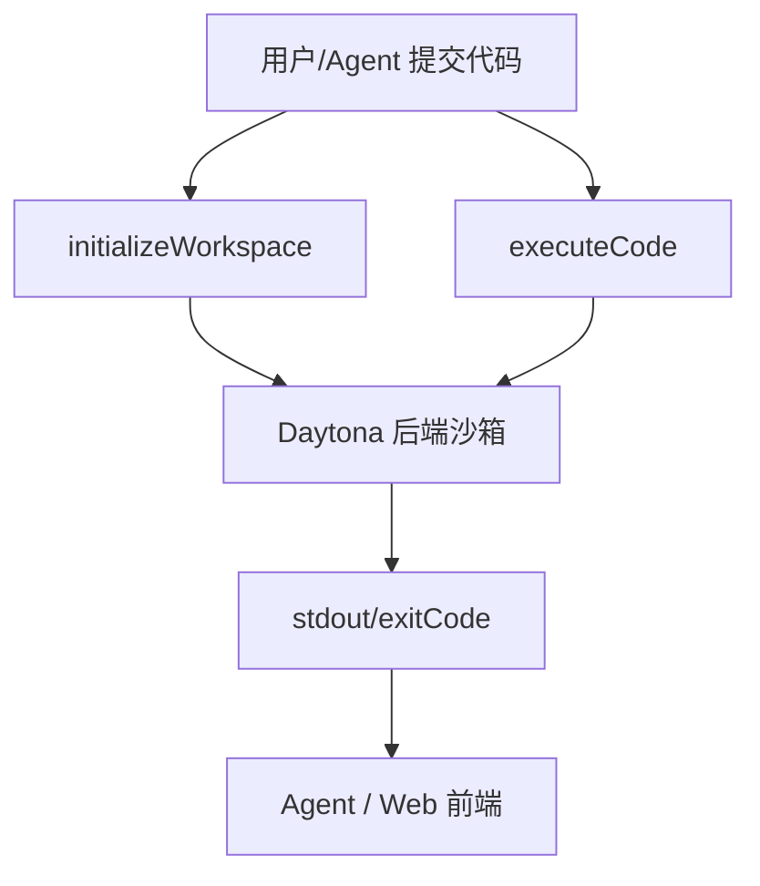

## Daytona Code Executor

### 1. 仓库地址
[Daytona Code Executor](https://github.com/radisicc/codeexecutor)

### 2. 项目简介
基于 Daytona 平台的 Web/CLI 沙箱执行器，支持 JS/TS/Python 代码在 Daytona 提供的隔离 workspace 中运行，并结合 Anthropic 模型做代码分析/解释。

### 3. 主要技术栈
- TypeScript + Daytona SDK（`@daytonaio/sdk`）管理远程工作区；dotenv 读取密钥。【F:codeexecutor/executor.ts†L1-L15】
- 支持多语言执行（ts/js/py）与 CLI 交互式输入。【F:codeexecutor/README.md†L7-L25】【F:codeexecutor/cli.ts†L29-L69】

### 4. 与 AI 编程 Agent 的结合方式
- 通过 Anthropic API key（配置在 `.env`）可在服务器端做代码分析/解释（README 描述“AI-powered”）。
- Agent 可调用 `CodeExecutor.initializeWorkspace` 创建沙箱、`executeCode` 运行代码、`cleanup` 释放资源，可在流水线里串联并行工作区。

### 5. Sandbox 技术实现
- Daytona 工作区充当隔离容器；`create` 创建 workspace，`process.codeRun` 远程执行代码并返回 stdout/exitCode。【F:codeexecutor/executor.ts†L25-L55】
- 支持并行：可同时创建多个 workspace 实例；每个 workspace 自带进程和依赖隔离（依赖 Daytona 后端实现）。
- 清理：`daytona.remove(workspace)` 释放资源。【F:codeexecutor/executor.ts†L60-L68】

### 6. 关键模块说明（流程）
- `CodeExecutor.initializeWorkspace(language)`: 校验语言 -> Daytona `create` -> 返回 workspace id。【F:codeexecutor/executor.ts†L18-L30】
- `executeCode(code)`: 调用 `workspace.process.codeRun`，返回 success/exitCode/output。【F:codeexecutor/executor.ts†L35-L55】
- `cleanup()`: 删除 workspace，避免资源泄漏。【F:codeexecutor/executor.ts†L60-L68】

### 7. 使用示例
- 设置环境变量并运行：`DAYTONA_API_KEY=...`、`DAYTONA_SERVER_URL=...`，`npm start` 打开 web/cli。【F:codeexecutor/README.md†L14-L25】
- CLI 交互：输入语言 -> 输入代码（多行）-> `executeCode` -> 输出结果。【F:codeexecutor/cli.ts†L29-L69】

### 8. 优点、缺点分析与适用场景
- 优点：远程隔离（Daytona）、多语言支持、代码运行与清理封装简单；可并行创建多个 workspace；可嵌入 AI 分析。
- 缺点：依赖 Daytona SaaS（需 API Key）；缺少资源配额与安全策略暴露；示例侧重 CLI/Web，Agent 接口需二次封装；无文件上传/下载范式说明。
- 适用：需要云端隔离执行且无需自管 Docker 的团队、想快速把 coding agent 接到 Daytona 的原型、并行作业/课堂演示环境。

### 9. 进一步调研建议或可拓展点
- 量化 Daytona workspace 启动与并行吞吐；补充文件/依赖缓存示例。
- 将 Anthropic/Claude 工具化（如“代码解释”“优化建议”）形成技能集，让 agent 更通用。
- 对接 MCP 或 LangGraph 等框架，验证并行多任务/多工作区编排体验。
