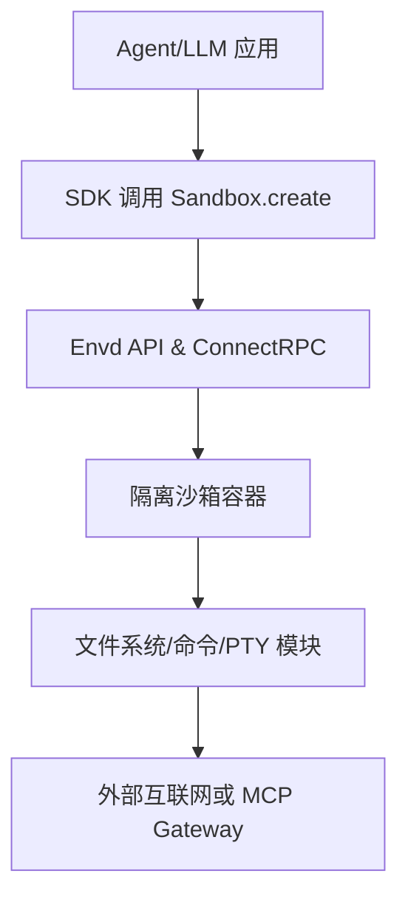

## E2B 安全云沙箱

### 1. 仓库地址
[E2B](https://github.com/e2b-dev/e2b)

### 2. 项目简介
E2B 提供开源的云端安全沙箱基础设施，让 AI 生成代码可以在隔离环境中运行，并通过 JS/Python SDK 创建、管理沙箱实例。【F:e2b/README.md†L22-L27】

### 3. 主要技术栈
- TypeScript/Node.js 与 Python SDK（与 ConnectRPC、gRPC 互通）。【F:e2b/packages/js-sdk/src/sandbox/index.ts†L1-L25】
- 沙箱端运行 Linux，提供文件系统、命令执行、PTY 等能力。【F:e2b/packages/js-sdk/src/sandbox/index.ts†L45-L78】
- 后端通过 `envd` API 暴露 gRPC/HTTP 通道，并支持签名 URL、访问令牌控制。【F:e2b/packages/js-sdk/src/sandbox/index.ts†L133-L187】

### 4. 与 AI 编程 Agent 的结合方式
- SDK 用于在 Agent 工作流中动态创建沙箱（`Sandbox.create()`），执行代码、持久化文件，并可与 LLM 工具链结合。【F:e2b/README.md†L52-L71】
- 默认模板 `base` 提供通用 Linux 环境，也有 `mcp-gateway` 模板用于 MCP Agent 访问外部服务。【F:e2b/packages/js-sdk/src/sandbox/index.ts†L65-L100】
- 通过 traffic access token 与 MCP 端口（50005）暴露服务，方便 Agent 与其他微服务交互。【F:e2b/packages/js-sdk/src/sandbox/index.ts†L93-L105】

### 5. Sandbox 技术实现
- 沙箱为独立容器，暴露文件系统、命令执行、PTY；支持网络访问但通过令牌限制流量来源。【F:e2b/packages/js-sdk/src/sandbox/index.ts†L45-L105】
- SDK 使用 ConnectRPC transport，将请求带上 Sandbox ID 与 Access Token，保证仅授权的会话可访问。【F:e2b/packages/js-sdk/src/sandbox/index.ts†L138-L187】
- 支持签名 URL 方式上传/下载文件，过期时间可配置，降低数据泄漏风险。【F:e2b/packages/js-sdk/src/sandbox/index.ts†L31-L42】

### 6. 关键模块说明
- `Sandbox` 类：封装文件、命令、PTY 子模块，并维护沙箱域名/令牌等连接信息。【F:e2b/packages/js-sdk/src/sandbox/index.ts†L65-L199】
- `Filesystem` / `Commands` / `Pty`：分别处理文件 API、命令执行、交互式终端，均通过 RPC 与沙箱通信。【F:e2b/packages/js-sdk/src/sandbox/index.ts†L188-L199】
- 连接配置 `ConnectionConfig` 负责域名、Header、默认超时等，隐藏基础网络细节。【F:e2b/packages/js-sdk/src/sandbox/index.ts†L4-L25】



### 7. 使用示例
- Node.js 创建沙箱并执行代码：
```ts
import { Sandbox } from '@e2b/code-interpreter'
const sandbox = await Sandbox.create()
await sandbox.runCode('x = 1')
const execution = await sandbox.runCode('x+=1; x')
console.log(execution.text) // 2
```
【F:e2b/README.md†L52-L61】
- Python 上下文管理执行：
```py
from e2b_code_interpreter import Sandbox
with Sandbox.create() as sandbox:
    sandbox.run_code("x = 1")
    execution = sandbox.run_code("x+=1; x")
    print(execution.text)
```
【F:e2b/README.md†L64-L71】

### 8. 优点、缺点分析与适用场景
- 优点：隔离性强（独立容器 + 访问令牌）、SDK 简单、文件/命令/PTY 功能齐全、支持签名 URL 方便安全传输。
- 缺点：需外部 E2B 基础设施或自建；默认模板有限，如需 GPU/特殊依赖需自定义镜像；连接依赖网络延迟。
- 适用场景：需要大语言模型自动编程并在线运行代码的 SaaS、IDE Agent、MCP Agent 网关、自托管安全沙箱集群。

### 9. 进一步调研建议或可拓展点
- 评估自建基础设施（Terraform 部署）与商业托管的性能/成本差异。
- 探索自定义模板扩展 GPU、特定语言运行时或企业私有网络接入方案。
- 与代理框架（如 LangGraph、OpenHands）联合实验，比较任务完成率与安全事件统计。
