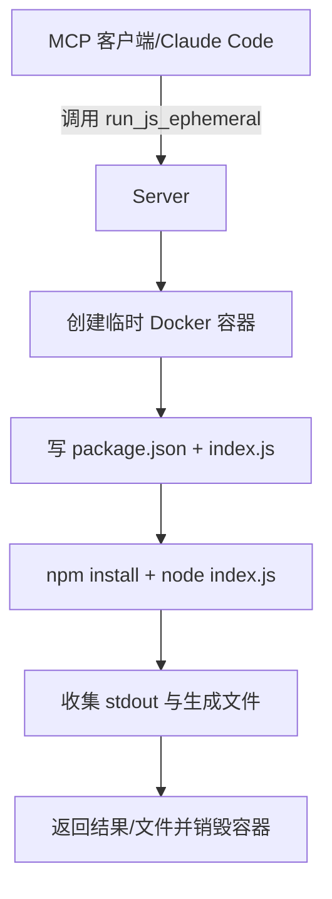

## Node.js Sandbox MCP Server

### 1. 仓库地址
[node-code-sandbox-mcp](https://github.com/ssdeanx/node-code-sandbox-mcp)

### 2. 项目简介
基于 MCP（Model Context Protocol）的 Node.js 服务器，为 Claude Code 等 MCP 客户端提供可即刻拉起的 Node.js Docker 沙箱，支持动态安装 npm 依赖并执行 JS/TS 代码，适合在 IDE/Agent 中安全运行用户代码。

### 3. 主要技术栈
- Node.js + Docker：通过 Docker 拉起 ephemeral 容器或长连容器执行代码。【F:node-code-sandbox-mcp/README.md†L11-L25】【F:node-code-sandbox-mcp/README.md†L210-L256】
- MCP 协议：以工具形式暴露 `run_js_ephemeral`、`sandbox_initialize`、`run_js`、`sandbox_exec`、`sandbox_stop`。

### 4. 与 AI 编程 Agent 的结合方式
- Claude Desktop / VS Code MCP 客户端可通过配置启动该服务器，Agent 直接调用工具在隔离容器内执行 JS，避免宿主暴露。【F:node-code-sandbox-mcp/README.md†L57-L155】
- 支持“Detached Mode”在容器内起服务并映射端口，便于 Agent 并行拉起多个任务或服务调试。【F:node-code-sandbox-mcp/README.md†L16-L25】【F:node-code-sandbox-mcp/README.md†L237-L246】

### 5. Sandbox 技术实现
- Ephemeral 模式：`run_js_ephemeral` 单次运行，自动创建容器、写入代码与 package.json、安装依赖、执行并清理，保存的文件会随响应返回。【F:node-code-sandbox-mcp/README.md†L161-L200】
- Session 模式：`sandbox_initialize` -> `run_js`/`sandbox_exec` -> `sandbox_stop`，可复用依赖并串行/并行执行多个命令；可指定资源限制（CPU/内存 env）。【F:node-code-sandbox-mcp/README.md†L210-L270】【F:node-code-sandbox-mcp/README.md†L25-L35】
- 通过 Docker socket 控制容器，利用环境变量设置 CPU/Mem quota 保障隔离。【F:node-code-sandbox-mcp/README.md†L110-L155】

### 6. 关键模块说明（流程）


### 7. 使用示例
- MCP 配置（Claude Desktop）：指定 docker 运行镜像并挂载宿主输出目录与 docker.sock。【F:node-code-sandbox-mcp/README.md†L57-L105】
- 工具调用：
```jsonc
{
  "name": "run_js_ephemeral",
  "arguments": {
    "image": "node:lts-slim",
    "code": "console.log('One-shot run!');",
    "dependencies": [{"name":"lodash","version":"^4.17.21"}]
  }
}
```
【F:node-code-sandbox-mcp/README.md†L186-L196】

### 8. 优点、缺点分析与适用场景
- 优点：完全隔离（Docker）、支持即席依赖安装与文件回传；支持长连容器/端口映射便于并行或服务调试；配置简单（MCP 标准）。
- 缺点：仅 Node.js 生态；需要本机 Docker 权限，安全边界取决于 docker.sock 暴露；没有多语言并行执行调度逻辑，需要客户端/Agent 侧管理。
- 适用：Claude Code/VS Code 中的 JS/TS 代码实验、带 npm 依赖的快速脚本、需要端口暴露的前端/服务样例。

### 9. 进一步调研建议或可拓展点
- 增加多语言支持或通过 MCP 资源模板返回容器日志/监控数据，便于并行调度。
- 引入作业队列/并行执行管理（限制并发容器数、重用缓存层）。
- 评估与技能体系结合（如“安装依赖”“运行测试”工具）形成通用 coding agent 流程。
