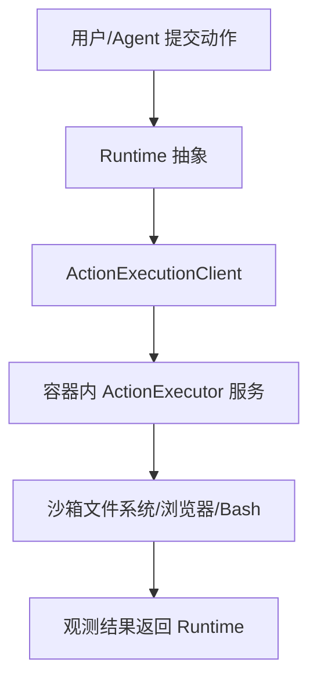

## OpenHands（原 OpenDevin）

### 1. 仓库地址
[OpenHands](https://github.com/OpenHands/OpenHands)

### 2. 项目简介
OpenHands 是一套开源 AI 编程代理系统，核心为 Python Runtime：以事件流驱动的 `Runtime` 接口协调 bash、浏览器与文件操作，并通过容器化沙箱执行 Agent 动作，默认使用 Docker 隔离。【F:OpenDevin/openhands/runtime/README.md†L5-L119】

### 3. 主要技术栈
- Python 运行时与插件体系，提供异步 Action 执行与事件流。【F:OpenDevin/openhands/runtime/README.md†L12-L41】【F:OpenDevin/openhands/runtime/README.md†L61-L83】
- Docker 容器作为默认沙箱，支持本地、远程、Modal、Runloop 等多种 Runtime 实现。【F:OpenDevin/openhands/runtime/README.md†L43-L153】
- WebSocket/Socket.io 管理会话，`config.sandbox.close_delay` 控制沙箱生命周期。【F:OpenDevin/openhands/server/session/README.md†L4-L19】

### 4. 与 AI 编程 Agent 的结合方式
- Agent 通过 Runtime 抽象提交动作（运行 bash、读写文件、浏览网页）；`Runtime` 将动作转发到容器中的 `ActionExecutor` 服务并返回观测结果。【F:OpenDevin/openhands/runtime/README.md†L12-L48】【F:OpenDevin/openhands/runtime/README.md†L61-L83】
- 支持多种后端沙箱：本地 Docker（默认）、远程 HTTP API、Modal、Runloop、E2B 等，可根据资源/安全策略切换。【F:OpenDevin/openhands/runtime/README.md†L43-L153】【F:OpenDevin/third_party/runtime/impl/runloop/README.md†L1-L24】【F:OpenDevin/third_party/runtime/impl/e2b/README.md†L1-L21】

### 5. Sandbox 技术实现
- 默认 Docker Runtime：为每个会话创建容器，动作在容器内执行，具备文件系统访问、实时日志与隔离性。【F:OpenDevin/openhands/runtime/README.md†L104-L119】
- 支持 Local Runtime（无隔离，警告用于开发）与 Remote Runtime（远程执行，便于扩展或隔离）。【F:OpenDevin/openhands/runtime/README.md†L121-L152】
- 可自定义 runtime 镜像，`containers/runtime` 动态生成 Dockerfile，将当前 commit 的源代码与基础镜像打包。【F:OpenDevin/containers/runtime/README.md†L1-L12】
- 通过配置的关闭延迟定时销毁空闲会话，降低资源占用并减少沙箱长期暴露。【F:OpenDevin/openhands/server/session/README.md†L15-L19】

### 6. 关键模块说明（可配图/伪代码）
- `Runtime`（`base.py`）：统一接口，定义 run/read/write/browse 等动作以及环境初始化流程。【F:OpenDevin/openhands/runtime/README.md†L12-L35】
- `ActionExecutionClient` / `ActionExecutor`：客户端将动作通过 HTTP 发往容器内服务器，服务器执行后返回观测。【F:OpenDevin/openhands/runtime/README.md†L26-L48】
- `impl/`：封装 Docker、Remote、Modal、Runloop 等不同沙箱生命周期管理器。【F:OpenDevin/openhands/runtime/README.md†L43-L153】



### 7. 使用示例
- 手动构建核心镜像与沙箱镜像（适合自托管测试）：
```bash
docker build -f containers/app/Dockerfile -t openhands .
docker build -f containers/sandbox/Dockerfile -t sandbox .
```
【F:OpenDevin/containers/README.md†L7-L12】
- 若使用 Runloop/E2B 等托管沙箱，设置对应 API Key 并切换 `RUNTIME` 环境变量即可（如 Runloop：`export RUNTIME="runloop"`）。【F:OpenDevin/third_party/runtime/impl/runloop/README.md†L10-L24】【F:OpenDevin/third_party/runtime/impl/e2b/README.md†L7-L21】

### 8. 优点、缺点分析与适用场景
- 优点：Runtime 抽象灵活，多种沙箱后端可插拔；默认 Docker 隔离较安全；支持浏览器/文件/命令等全功能，便于自动修复代码。
- 缺点：部署体量大（多镜像），默认容器需要资源；Local Runtime 无隔离需谨慎；Remote/Modal 依赖外部服务或 API Key。
- 适用场景：需要可控隔离的企业/团队内 AI 编程助手；评测基准（SWE-Bench）或大规模多会话实验；需要在不同沙箱后端间灵活切换的集成环境。

### 9. 进一步调研建议或可拓展点
- 对比 Docker vs Runloop vs E2B 的启动延迟、网络吞吐与安全策略，形成量化评测。
- 研究 Runtime 插件（如浏览器、技能库）在不同沙箱中的兼容性，减少环境差异。
- 探索与 MCP 服务器结合（例如文件/浏览器工具标准化）以支持 IDE/多代理协作场景。
